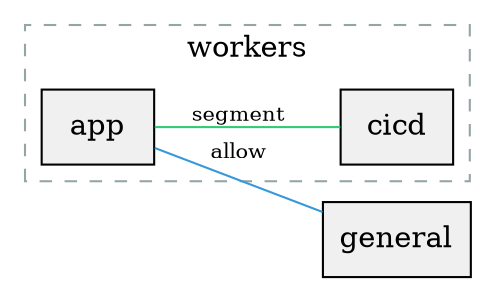

# Compiler Semantic Toolchain

Semantic outputs that make the compiler's decisions inspectable. Enable via the `inspect` field nested inside each IR module's config object (`centralized_router.inspect`, `full_mesh_trio.inspect`, `super_router.inspect`) to dump artifacts to JSON files.

```hcl
centralized_router = {
  # ...
  inspect = {
    reachability    = true
    diagnostics    = true
    provenance     = true
    segment_report       = true
    policy_normalization = true
    connectivity_graph   = true
    policy_diff = {
      previous_reachability = jsondecode(file("inspect/centralized-router-name-reachability.json"))
    }
    assertions = {
      must_deny   = [{ from = vpcs["prod"], to = vpcs["dev"] }]
      must_permit = [{ from = vpcs["app"], to = vpcs["db"] }]
    }
    equivalence = {
      equivalent_routing_policy = { ... }
    }
  }
}
```

## Reachability Matrix

The algebra's per-pair verdict as structured data. For every VPC pair, shows whether connectivity is permitted or denied and which precedence level determined the outcome.

```json
{
  "app:db": "permitted:segment",
  "app:cache": "permitted:allow",
  "web:db": "denied:cross-segment",
  "monitor:db": "denied:default"
}
```

Pairs are deduplicated since rules are bidirectional. `"app:db"` implicitly covers `"db:app"`. Only the lexicographically-first key is shown.

Six possible verdicts mapping directly to the precedence chain:
- `permitted:allow` - explicit allow rule fired
- `permitted:segment` - same-segment membership
- `permitted:default` - default="allow" fallthrough
- `denied:deny` - explicit deny rule (highest precedence)
- `denied:cross-segment` - different segments under default="allow"
- `denied:default` - default="deny" fallthrough

Separates "what the policy decided" from "what routes were emitted," making the algebra's output auditable without understanding route tables. All other toolchain outputs read from or operate on this matrix.

## Diagnostics

Compiler warnings for policy states that are valid but likely unintentional.

```json
[
  "VPC \"monitoring\" has zero connectivity. It is unsegmented under default=\"deny\" with no allow rules.",
  "Segment \"isolated\" contains only 1 VPC. Single-member segments have no routing effect under default=\"deny\".",
  "Deny rule { app -> db } is redundant: this pair would already be denied without it.",
  "Allow rule { app -> db } is redundant: this pair would already be permitted without it.",
  "Policy has 1 segment under default=\"allow\". A single segment has no routing effect when there is no other segment to deny against."
]
```

Five classes of warnings:
- **Zero connectivity** - a VPC with no outbound reachability (unsegmented under default="deny" with no allow rules)
- **Single-member segment** - a segment with one VPC has no routing effect under default="deny" (algebraically equivalent to unsegmented)
- **Redundant deny** - a deny rule on a pair that would already be denied without it (default="deny" with no allow or segment for that pair)
- **Redundant allow** - an allow rule on a pair that would already be permitted without it (default="allow" with no cross-segment deny for that pair)
- **Single segment no effect** - one segment under default="allow" has no routing effect (cross-segment denies require at least two segments)

This is `-Wall` for network policy. The compiler tells you when your program is technically valid but probably wrong.

## Provenance

Debug symbols for emitted routes. Each route carries metadata tracing it back to the source VPC pair and the policy primitive that authorized it.

```json
[
  {
    "route_table_id": "rtb-abc",
    "destination_cidr_block": "10.0.64.0/18",
    "from": "app",
    "to": "db",
    "verdict": "permitted",
    "reason": "segment"
  },
  {
    "route_table_id": "rtb-def",
    "destination_cidr_block": "172.18.0.0/18",
    "from": "app",
    "to": "cache",
    "verdict": "permitted",
    "reason": "allow"
  }
]
```

When you see a route in a VPC route table, provenance answers "why does this route exist?" by tracing it back to which policy primitive authorized it.

## Segment Report

Symbol table dump. Per-VPC view of segment membership and reachability. A pivot of the reachability matrix from pair-oriented to VPC-oriented.

```json
{
  "app": {
    "segment": "workers",
    "reaches": ["cicd", "general"],
    "denied": []
  },
  "cicd": {
    "segment": "workers",
    "reaches": ["app", "general"],
    "denied": []
  },
  "db": {
    "segment": "unsegmented",
    "reaches": [],
    "denied": ["app", "cicd", "general"]
  },
  "general": {
    "segment": "unsegmented",
    "reaches": ["app", "cicd"],
    "denied": ["db"]
  }
}
```

Enable via `inspect.segment_report = true` nested inside the IR module's config object:

```hcl
centralized_router = {
  # ...
  inspect = {
    segment_report = true
  }
}
```

Three fields per VPC:
- **segment** - which segment the VPC belongs to, or `"unsegmented"` if not in any segment
- **reaches** - VPC names this VPC has permitted connectivity to
- **denied** - VPC names this VPC is denied connectivity to

The reachability matrix is pair-oriented. The segment report is VPC-oriented. Same information, different axis. Engineers troubleshoot from one VPC ("what can app talk to?"), not from a pair.

## Policy Normalization

Optimizer and decompiler. Given any policy, emit the minimal equivalent policy. The normalizer walks the compiled reachability matrix and reconstructs the shortest policy that produces the same connectivity.

```json
{
  "current_rule_count": 3,
  "normalized_rule_count": 1,
  "normalized_policy": {
    "default": "deny",
    "segments": {
      "group_0": ["app", "cicd", "general"]
    },
    "allow": [],
    "deny": []
  }
}
```

Enable via `inspect.policy_normalization = true` nested inside the IR module's config object:

```hcl
centralized_router = {
  # ...
  inspect = {
    policy_normalization = true
  }
}
```

Three output fields:
- **current_rule_count** - total primitives in the current policy (deny rules + allow rules + segments)
- **normalized_rule_count** - total primitives in the normalized policy
- **normalized_policy** - the reconstructed minimal policy with default, segments, allow, and deny

The normalizer:
1. Tries both `default="deny"` and `default="allow"`
2. Under `default="deny"`, detects segment candidates via reachability fingerprinting (VPCs with identical connectivity profiles are natural segment candidates)
3. Each detected segment replaces multiple allow rules with one segment declaration
4. Compares the total primitive count under each default and picks the shorter form

Examples of what the normalizer detects:
- 3 explicit allow rules forming a full mesh -> `default="allow"` with 0 rules
- 2 deny rules isolating a VPC -> `default="deny"` with 1 segment
- 2 allow rules under deny -> `default="allow"` with 1 deny rule

Surfaces when a default switch or segment reorganization would simplify the policy. It gives engineers confidence their policy is not carrying dead weight.

### Interpreting the output

Compare `current_rule_count` to `normalized_rule_count`. If they are equal, your policy is already minimal for the reachability it produces. If the normalized count is lower, the `normalized_policy` shows a shorter form that produces identical connectivity.

The normalizer may suggest a different `default` than the one you wrote. A policy with `default="deny"`, 2 segments, and 1 allow rule might normalize to `default="allow"` with 1 deny rule. Both produce the same reachability. The normalizer picks whichever form uses fewer primitives.

A lower normalized count does not mean you should switch. The current policy may encode structural intent (segment names, explicit groupings) that the normalizer cannot see. The output tells you the reachability cost of that intent: "you wrote 3 rules but 1 would produce the same connectivity." Whether the extra structure is worth keeping is a judgment call.

## Policy Diff

Incremental compilation. Given the previous reachability matrix (from a prior run), computes what changed in connectivity at the semantic level.

```json
{
  "added": ["app:monitor"],
  "removed": ["app:db"],
  "unchanged": ["api:app", "api:web"]
}
```

Pairs follow the same deduplication as the reachability matrix.

Pass the previous reachability via `inspect.policy_diff.previous_reachability` nested inside the IR module's config object:

```hcl
centralized_router = {
  # ...
  inspect = {
    policy_diff = {
      previous_reachability = jsondecode(file("inspect/myrouter-reachability.json"))
    }
  }
}
```

The workflow:
1. Enable `inspect.reachability = true` to dump the reachability matrix to a JSON file
2. Change the routing policy
3. Pass the previous JSON file via `inspect.policy_diff.previous_reachability`
4. The diff output shows added/removed/unchanged pairs

This answers "what did this policy change actually do?" at the semantic level. `terraform plan` shows route additions/removals (assembly diff). Policy diff shows reachability changes (source-level diff).

## Blast Radius

Impact analysis. Operational impact of a policy change. Given the previous reachability (same input as policy diff), computes which VPCs are affected and how many routes will be added or removed.

```json
{
  "affected_vpcs": ["app", "db"],
  "routes_added": 12,
  "routes_removed": 4,
  "pairs_changed": 2,
  "route_tables_affected": 8
}
```

When nothing changed:

```json
{
  "affected_vpcs": [],
  "routes_added": 0,
  "routes_removed": 0,
  "pairs_changed": 0,
  "route_tables_affected": 0
}
```

Blast radius is automatically computed whenever `inspect.policy_diff.previous_reachability` is provided. No separate input is needed.

Five metrics:
- **affected_vpcs** - VPC names that appear in any added or removed pair
- **routes_added** - total route table entries created by newly permitted pairs (route tables * destination CIDRs, bidirectional)
- **routes_removed** - total route table entries destroyed by newly denied pairs
- **pairs_changed** - count of added + removed pairs (sum of policy diff's added and removed lists)
- **route_tables_affected** - distinct route tables across all affected VPCs

Route counts account for secondary CIDRs. A VPC with 3 route tables and 2 CIDRs (primary + 1 secondary) contributes 6 routes per permitted pair direction, not 3.

The diff tells you what changed semantically. Blast radius tells you how big the change is operationally. That is the difference between "app:db connectivity changed" and "this change touches 2 VPCs and 16 routes across 8 route tables." Engineers and change advisory boards care about scope, not just content.

## Assertions

Static analysis. Postcondition checks on the compiled reachability. Declare invariants that the policy must satisfy, and the compiler verifies them against the reachability matrix at plan time.

```json
{
  "passed": true,
  "violations": {
    "must_deny": [],
    "must_permit": []
  }
}
```

When an assertion is violated:

```json
{
  "passed": false,
  "violations": {
    "must_deny": [],
    "must_permit": [
      {
        "pair": "app:db",
        "verdict": "denied:default"
      }
    ]
  }
}
```

Pass assertions via `inspect.assertions` nested inside the IR module's config object:

```hcl
centralized_router = {
  # ...
  inspect = {
    assertions = {
      must_deny = [
        { from = vpcs["prod"], to = vpcs["dev"] },
      ]
      must_permit = [
        { from = vpcs["app"], to = vpcs["db"] },
        { from = vpcs["app"], to = vpcs["web"] },
      ]
    }
  }
}
```

Two assertion types:
- **must_deny** - the pair must be denied. Fails if the reachability verdict is any `permitted:*` outcome.
- **must_permit** - the pair must be permitted. Fails if the reachability verdict is any `denied:*` outcome.

Assertions use the same VPC object references as allow/deny rules, with the same pair deduplication as the reachability matrix.

Assertions separate policy authorship from policy verification. The routing policy defines what connectivity should be. Assertions define what connectivity must (or must not) be, regardless of how the policy achieves it. A security team can define assertions independently of the network team's policy decisions.

The assertions output also validates that assertion CIDRs reference VPCs in the router's scope, preventing stale or misconfigured assertions from passing silently.

Use cases:
- Compliance invariants: "cardholder data VPCs must never reach general workloads" (PCI DSS segmentation)
- Security boundaries: "production must never reach development" enforced on every plan
- Connectivity contracts: "monitoring must always reach all application VPCs" guaranteed across policy changes
- Change safety: policy modifications are checked against standing assertions before any infrastructure is applied

## Equivalence

Translation validation. Proves that two different policy declarations produce identical reachability. This is the network policy equivalent of "these two programs compute the same function."

```json
{
  "equivalent": true,
  "mismatches": {}
}
```

When policies differ:

```json
{
  "equivalent": false,
  "mismatches": {
    "app:db": {
      "routing_policy": "permitted:default",
      "equivalent_routing_policy": "denied:deny"
    }
  }
}
```

Mismatches follow the same deduplication as the reachability matrix.

Pass the second policy via `inspect.equivalence.equivalent_routing_policy` nested inside the IR module's config object:

```hcl
centralized_router = {
  # ...
  routing_policy = {
    default = "allow"
    deny    = [{ from = vpcs["app"], to = vpcs["db"] }]
  }
  inspect = {
    equivalence = {
      equivalent_routing_policy = {
        default = "deny"
        allow = [
          { from = vpcs["app"], to = vpcs["web"] },
          { from = vpcs["db"], to = vpcs["web"] },
        ]
      }
    }
  }
}
```

Equivalence compares permit/deny outcomes only. The verdict reason (which rule caused it) is irrelevant. Two policies are equivalent if every VPC pair has the same reachability regardless of how it was derived.

Use cases:
- Migration proof: rewriting from allow-with-denies to deny-with-allows without changing behavior
- Simplification: proving a shorter policy is equivalent to a longer one
- Refactoring: reorganizing segments into explicit allows (or vice versa) with proof of no regression

## Connectivity Graph

CFG export. DOT format rendering of the reachability matrix for Graphviz visualization. Nodes are VPCs, edges are permitted pairs, and segment memberships are rendered as subgraph clusters.



Enable via `inspect.connectivity_graph = true` nested inside the IR module's config object:

```hcl
centralized_router = {
  # ...
  inspect = {
    connectivity_graph = true
  }
}
```

The output is a `.dot` file (not JSON) written to `inspect/<router-name>-connectivity-graph.dot`. Render it with Graphviz:

```sh
brew install graphviz
dot -Tpng inspect/myrouter-connectivity-graph.dot -o connectivity.png
dot -Tsvg inspect/myrouter-connectivity-graph.dot -o connectivity.svg
```

Edge colors encode the verdict reason:
- **Blue (#3498db)** - `allow` rule
- **Green (#2ecc71)** - `segment` membership
- **Gray (#95a5a6)** - `default` fallthrough

Denied pairs produce no edges. A fully denied graph renders all nodes with no connections. Segment clusters appear as dashed boxes grouping their member VPCs. Unsegmented VPCs appear as standalone nodes.

This is the reachability matrix rendered spatially. Engineers scan a DOT graph faster than they read a JSON matrix, especially as VPC count grows. Segment clusters make isolation boundaries visible at a glance, and edge colors distinguish why connectivity exists without reading verdict strings.
